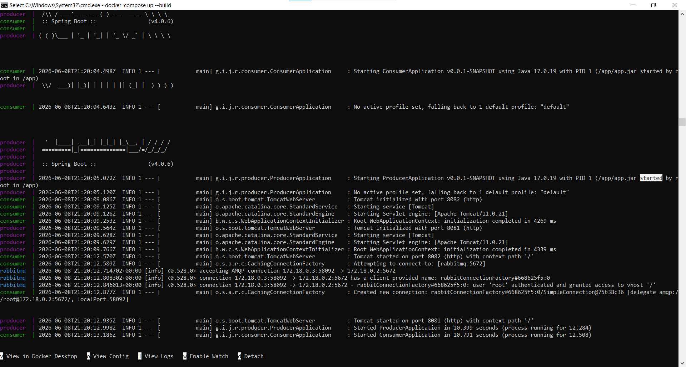
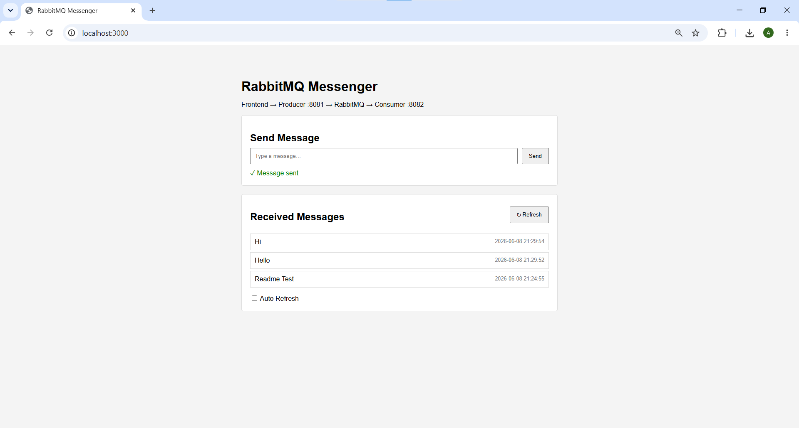
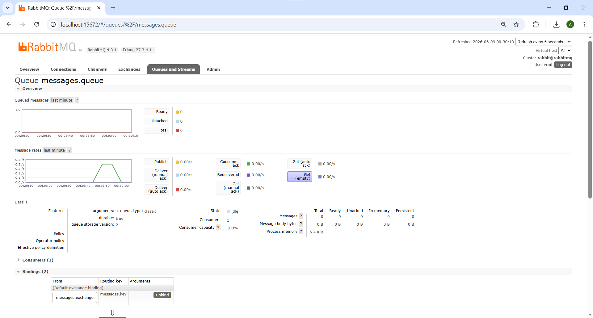

# RabbitMQ Messaging System

A minimal messaging system built with Docker Compose, RabbitMQ, Spring Boot.

## Architecture

```
Frontend (port 3000)
    │
    ▼  POST /messages
Producer Service (port 8081)
    │
    ▼  messages.exchange ──[messages.key]──► messages.queue
RabbitMQ (port 5672 / UI: 15672)
    │
    ▼  @RabbitListener
Consumer Service (port 8082)
    │
    ▼  GET /messages
Frontend (port 3000)
```

## Project Structure

```
messaging-system/
├── docker-compose.yml
├── producer/
│   ├── Dockerfile
│   ├── pom.xml
│   └── src/main/java/com/example/producer/
│       ├── ProducerApplication.java
│       ├── config/
│       │   └── RabbitMQConfig.java      ← Exchange, Queue, Binding
│       └── controller/
│           └── MessageController.java   ← POST /messages
│
├── consumer/
│   ├── Dockerfile
│   ├── pom.xml
│   └── src/main/java/com/example/consumer/
│       ├── ConsumerApplication.java
│       ├── config/
│       │   └── RabbitMQConfig.java      ← mirrors producer config
│       ├── listener/
│       │   └── MessageListener.java     ← @RabbitListener + in-memory store
│       └── controller/
│           └── MessageController.java   ← GET /messages
└── frontend/
    ├── Dockerfile
    ├── nginx.conf
    └── index.html                    ← Send & view messages
```

## Prerequisites

- Docker & Docker Compose installed
- Ports 3000, 5672, 8081, 8082, 15672 free

## Run Instructions

### 1. Clone / place the project

```bash
cd messaging-system
```

### 2. Build and start all services

```bash
docker compose up --build
```

> First build downloads Maven dependencies and compiles both Spring Boot jars — this takes **3–5 minutes**. Subsequent starts are fast.

### 3. Wait for healthy startup

You'll see lines like:
```
consumer  | Started ConsumerApplication in 4.2 seconds
producer  | Started ProducerApplication in 3.8 seconds
```

### 4. Open the frontend

```
http://localhost:3000
```

### 5. Other useful URLs

| Service              | URL                                    |
|----------------------|----------------------------------------|
| Frontend             | http://localhost:3000                  |
| Producer API         | http://localhost:8081/messages (POST)  |
| Consumer API         | http://localhost:8082/messages (GET)   |
| RabbitMQ Management  | http://localhost:15672 (root / root)   |

## Usage

1. Type a message in the input box and click **Send** (or press Enter).
2. Click **↻ Refresh** or enable **Auto Refresh** to see received messages.
3. Messages appear with timestamp in the list below.

## Stop

```bash
docker compose down
```

To also remove persisted RabbitMQ data:
```bash
docker compose down -v
rm -rf ./data ./log
```

## RabbitMQ Config Summary

| Item        | Value              |
|-------------|--------------------|
| Exchange    | `messages.exchange` (Direct) |
| Queue       | `messages.queue`   |
| Binding key | `messages.key`     |
| User        | `root` / `root`    |

## Screenshots

### 1. All Services Running
> Terminal output after `docker compose up --build` — all 4 containers started successfully.



---

### 2. Sending/Receiving a Message (Frontend)
> `http://localhost:3000` — message typed and green `✓ Sent` confirmation visible, after clicking ↻ Refresh, the sent message appears in the list.



---

### 3. RabbitMQ Management UI
> `http://localhost:15672` → Queues → `messages.queue` — queue detail showing message stats.

